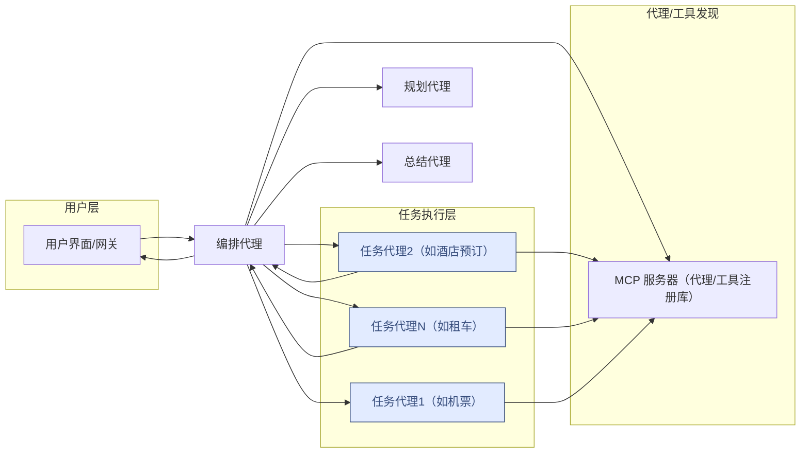

# 使用 MCP 作为注册中心的 A2A

**利用模型上下文协议（MCP）作为发现和检索 Google A2A Agent Card 的标准机制，实现基于 A2A 的动态代理交互。**

## 目录

- [使用 MCP 作为注册中心的 A2A](#使用-mcp-作为注册中心的-a2a)
  - [目录](#目录)
  - [目标](#目标)
  - [背景](#背景)
    - [A2A 协议](#a2a-协议)
    - [模型上下文协议（MCP）](#模型上下文协议mcp)
  - [核心方案](#核心方案)
    - [存储代理卡片](#存储代理卡片)
    - [通过 MCP 发现代理](#通过-mcp-发现代理)
    - [检索代理卡片](#检索代理卡片)
    - [为任务寻找代理](#为任务寻找代理)
    - [发起 A2A 通信](#发起-a2a-通信)
  - [用例：编排任务执行](#用例编排任务执行)
    - [核心概念](#核心概念)
    - [架构组件](#架构组件)
  - [示例流程：旅行代理](#示例流程旅行代理)
  - [示例执行步骤](#示例执行步骤)
    - [文件/目录说明](#文件目录说明)
  - [免责声明](#免责声明)

## 目标

利用模型上下文协议（MCP）作为发现和检索 Google A2A Agent Card 的标准机制，使规划和编排代理能够动态交互，充分利用 A2A 协议。

## 背景

### A2A 协议

Agent-to-Agent（A2A）协议标准化了代理之间的运行时通信。它定义了：

- **代理卡片（Agent Card）：** 描述代理身份、能力（动作/函数）和交互端点的 JSON 架构。
- **消息格式与交互流程：** 如 `ExecuteTask` 用于代理间直接交互。

### 模型上下文协议（MCP）

MCP 定义了一种标准方式，使应用（包括 AI 模型）能够发现、访问和利用上下文信息（如“工具”、“资源”等）。

## 核心方案

核心思想是使用 MCP 服务器作为集中、可查询的 A2A Agent Card 注册库。

### 存储代理卡片

- 每个 A2A Agent Card（JSON）都被存储（如作为 JSON 文件）。
- MCP 服务器将这些 Agent Card 作为资源暴露。
- 底层存储可以是文件系统、数据库或向量库。本示例使用文件系统存储代理卡片，生成嵌入并用于匹配。

### 通过 MCP 发现代理

- 客户端通过 MCP 服务器的资源 API（`list_resources`）查询可用的代理卡片。
- 可通过元数据（如 `streaming` 支持、标签如“货币兑换”）进行过滤（本示例未详细覆盖）。

### 检索代理卡片

- 请求代理通过发现获得的资源 URI，使用 MCP 服务器 API 获取完整的 JSON Agent Card。

### 为任务寻找代理

- 请求代理可使用 MCP 服务器暴露的工具，针对特定查询找到最相关的代理。

### 发起 A2A 通信

- 获取 Agent Card 后，请求代理在 A2AClient 中使用它们。
- 需要协作的代理（如规划代理）随后通过标准 A2A 协议与目标代理直接通信。
- 发现后，MCP 不再参与运行时交互。

## 用例：编排任务执行

该系统支持专用代理动态协作的工作流。

### 核心概念

1. **编排：** 规划与执行代理管理用户查询的整体流程。
2. **专用化：** 任务代理专注于特定类型任务。
3. **动态发现：** MCP 服务器允许灵活增删、更新任务代理，无需修改执行器。
4. **标准化通信：** A2A 协议确保代理间可靠通信。

### 架构组件

1. **用户界面（UI）/应用网关：** 用户查询入口。
2. **编排代理：**
   - 接收规划代理生成的结构化计划。
   - 迭代执行任务。
   - 对每个任务：
     - 通过 MCP 服务器查询合适的任务代理（可基于能力）。
     - 通过 A2A 发送任务详情给任务代理。
     - 通过 A2A 接收任务代理返回的结果。
     - 管理任务状态与错误。
   - 验证结果，必要时触发重新规划。
   - 汇总、总结并格式化结果，返回给用户。
3. **规划代理：**
   - 接收原始用户查询。
   - 将查询分解为结构化任务计划（可为 DAG），并指定每步所需能力。
4. **模型上下文协议（MCP）服务器：**
   - 作为任务代理注册库，托管其 Agent Card。
   - 为执行代理提供代理和工具的查询接口。
5. **任务代理（池/集群）：**
   - 独立、专用的代理（如搜索、计算代理）。
   - 暴露兼容 A2A 的端点。
   - 执行任务并通过 A2A 返回结果。
6. **A2A 通信层：** 代理间通信的底层协议。



## 示例流程：旅行代理

1. 用户请求行程规划。
2. **编排代理**接收请求。
   1. 通过 MCP 查找**规划代理**卡片并连接。
   2. 调用规划代理获取详细计划。
   3. 对于计划中的每一步：
      1. 调用 MCP 工具（如 `find_agent`）获取最佳任务代理的 Agent Card。
      2. 通过 A2A 调用选定的任务代理执行任务：
         - _机票：_ 任务代理将使用 MCP 服务器的辅助工具，查询 SQLite 数据库获取航班。
         - _酒店：_ 任务代理将使用 MCP 服务器的辅助工具，查询 SQLite 数据库获取酒店。
         - _租车：_ 任务代理将使用 MCP 服务器的辅助工具，查询 SQLite 数据库获取租车信息。
      3. 将结果存储在内存中。
   4. 聚合结果并为客户端总结。
   5. 若发现预算不符或预订失败，则触发重新规划。

## 示例执行步骤

本示例使用 3 个 ADK 代理执行任务，1 个 LangGraph 代理作为规划器。
所有 3 个 ADK 代理使用相同的 Python 代码，但用不同的代理卡片实例化。

你可以在一个终端中执行以下命令完成所有步骤：

```sh
bash samples/python/agents/a2a_mcp/run.sh
```

1. 启动 MCP 服务器：

   ```sh
   cd samples/python/agents/a2a_mcp
   uv venv #（如未创建虚拟环境）
   source .venv/bin/activate
   # 默认运行在 10100 端口，可通过 --host 和 --port 参数修改。
   uv run  --env-file .env a2a-mcp --run mcp-server --transport sse
   ```

2. 启动编排代理：

   新开终端窗口

   ```bash
   cd samples/python/agents/a2a_mcp
   uv venv #（如未创建虚拟环境）
   source .venv/bin/activate
   # 可根据需要修改 host 和 port。
   uv run --env-file .env src/a2a_mcp/agents/ --agent-card agent_cards/orchestrator_agent.json --port 10101
   ```

3. 启动规划代理：

   新开终端窗口

   ```bash
   cd samples/python/agents/a2a_mcp
   uv venv #（如未创建虚拟环境）
   source .venv/bin/activate
   # 可根据需要修改 host 和 port。
   uv run  --env-file .env src/a2a_mcp/agents/ --agent-card agent_cards/planner_agent.json --port 10102
   ```

4. 启动机票代理：

   新开终端窗口

   ```bash
   cd samples/python/agents/a2a_mcp
   uv venv #（如未创建虚拟环境）
   source .venv/bin/activate
   # 可根据需要修改 host 和 port。
   uv run --env-file .env src/a2a_mcp/agents/ --agent-card agent_cards/air_ticketing_agent.json --port 10103
   ```

5. 启动酒店预订代理：

   新开终端窗口

   ```bash
   cd samples/python/agents/a2a_mcp
   uv venv #（如未创建虚拟环境）
   source .venv/bin/activate
   # 可根据需要修改 host 和 port。
   uv run  --env-file .env src/a2a_mcp/agents/ --agent-card agent_cards/hotel_booking_agent.json --port 10104
   ```

6. 启动租车代理：

   新开终端窗口

   ```bash
   cd samples/python/agents/a2a_mcp
   uv venv  #（如未创建虚拟环境）
   source .venv/bin/activate
   # 可根据需要修改 host 和 port。
   uv run --env-file .env src/a2a_mcp/agents/ --agent-card agent_cards/car_rental_agent.json --port 10105
   ```

7. 启动 cli：

   新开终端窗口

   ```bash
   cd samples/python/agents/a2a_mcp
   uv venv  #（如未创建虚拟环境）
   source .venv/bin/activate

   uv run --env-file .env src/a2a_mcp/mcp/client.py --resource "resource://agent_cards/list" --find_agent "我想规划一次去法国的旅行。"
   ```

### 文件/目录说明

- **`agent_cards/`**：存放每个 A2A Agent Card 的 JSON 架构。定义系统中不同代理的身份、能力和端点。MCP 服务器提供这些卡片。

  - `*_agent.json`：每个 JSON 文件代表一个代理卡片（如 `air_ticketing_agent.json` 代表机票代理）。

- **`src/a2a_mcp/`**：A2A with MCP 示例的主要 Python 源码。

  - **`agents/`**：包含各类代理的 Python 实现。
    - `__main__.py`：启动代理服务的主脚本。
    - `adk_travel_agent.py`：ADK 旅行代理核心代码，通过不同代理卡片实例化。
    - `langgraph_planner_agent.py`：LangGraph 实现的“规划代理”，负责将用户请求拆解为结构化计划。
    - `orchestrator_agent.py`：“编排代理”实现，接收规划代理计划，通过 MCP 发现合适任务代理，并用 A2A 调用。
  - **`common/`**：多代理或系统各部分共享代码。
    - `agent_executor.py`：A2A 模块，管理编排流程中的任务状态、依赖和执行。
    - `agent_runner.py`：运行 ADK 代理实例的工具或框架组件，管理其生命周期并暴露服务。
    - `base_agent.py`：所有代理的抽象基类或接口，定义通用方法和属性。
    - `prompts.py`：与大语言模型（LLM）交互用的预设提示模板（如规划、总结）。
    - `types.py`：定义项目中用到的自定义 Python 数据类型、Pydantic 模型或枚举（如任务、代理卡片结构、API 请求/响应等）。
    - `utils.py`：通用工具函数集合。
    - `workflow.py`：流程管理。
  - **`mcp/`**：MCP 相关实现。
    - `client.py`：MCP 客户端库，用于查询 MCP 服务器获取代理卡片或工具。仅为测试工具，代理不直接使用。
    - `server.py`：MCP 服务器实现，托管代理卡片资源。

- **`travel_agency.db`**：轻量级 SQLite 数据库，存放演示数据。

## 免责声明
重要提示：本示例代码仅用于演示 Agent-to-Agent（A2A）协议机制。构建生产应用时，任何不受你直接控制的代理都应视为不可信实体。

所有来自外部代理的数据——包括但不限于其 AgentCard、消息、工件和任务状态——都应视为不可信输入。例如，恶意代理可能在 AgentCard 字段（如 description、name、skills.description）中注入恶意数据。如果这些数据未经清洗直接用于构建大语言模型（LLM）提示，可能导致提示注入攻击。未对这些数据进行有效校验和清洗，可能引入安全漏洞。

开发者有责任实施适当的安全措施，如输入校验和凭据安全处理，以保护系统和用户。
